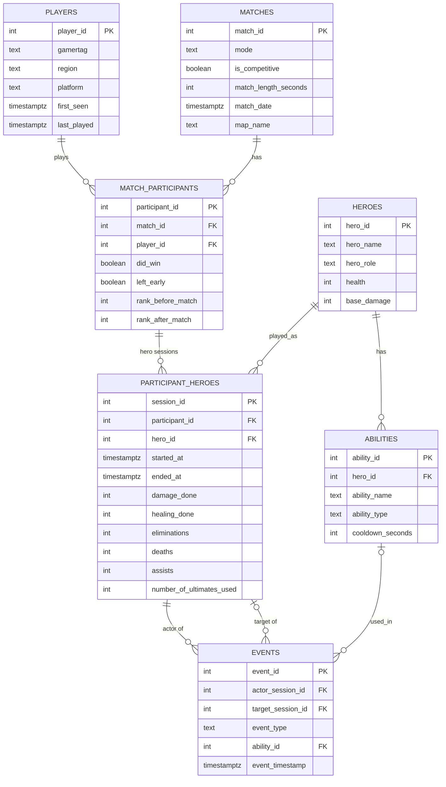

# Game Analytics DB

A PostgreSQL analytics database for Overwatch-style match data — schema design, a synthetic
data generator with a deliberately planted behavioral hypothesis, and analytical SQL
(window functions, CTEs, joins) to test it.

As an avid gamer that enjoys playing Overwatch, I wanted to mesh my gaming love with my joy for database management and analysis. One point of a game's life-cycle that I wanted to check was the correlation between repeated deaths by abilities and their effect on ragequitting. With that in mind, the generation of data for this schema baked in the possibility of ragequitting with a scalable probability as the player experienced repeated deaths by the same ability. The results showed a clear, measurable correlation between repeated ability-deaths and ragequitting.

## Tech stack

- **PostgreSQL** — schema, indexing, analytical SQL
- **Python** (psycopg2, Faker) — synthetic data generation
- No frameworks, no ORM — raw SQL throughout, by design

## Schema

Seven tables. `players`/`matches`/`heroes`/`abilities` are reference/dimension data;
`match_participants`/`participant_heroes`/`events` capture what actually happened.



| Table | Purpose |
|---|---|
| `players` | One row per player: gamertag, region, platform, `first_seen`, `last_played`. |
| `matches` | One row per match: mode, map, length, competitive flag, date. |
| `heroes` | Hero roster: name, role (Tank/Damage/Support), health, base damage. |
| `abilities` | Each hero's abilities: name, type (Primary/Secondary/Ultimate), cooldown. |
| `match_participants` | One row per player per match: win/loss, `left_early`, rank before/after. |
| `participant_heroes` | One row per hero played in a match — a player who switches heroes mid-match gets multiple rows. Carries `started_at`/`ended_at` and aggregate stats (damage, healing, eliminations, deaths, assists, ultimates used). |
| `events` | The event log: kills, deaths, ability uses, ultimate uses — each tied to an actor session, optional target session, and ability. |

`participant_heroes` (not `match_participants` directly) is the anchor for hero-switching —
a match_participant can have several hero sessions, each with its own event history.

## Data generation

`scripts/generate_data.py` generates 3,000 players and simulates matches from scratch:
players → matches (grouped from per-player timestamps into 10-player matches) →
participants → hero sessions (with mid-match hero switching) → events (kills, deaths,
ability/ultimate uses).

**The ragequit hypothesis**: on every death, the probability a player abandons the match
scales with how many times they've *already* died to that same ability in that match —
`min(90%, 1.1% + 2.5% × prior deaths to this ability)`. This is a known, planted ground
truth: the whole point is that the analytics queries in `queries/` should be able to
recover this pattern from the data alone, without knowing it was put there deliberately.

`backfill_stats.sql` derives `participant_heroes`' aggregate stat columns
(eliminations/deaths/ultimates as direct event counts; damage/healing as a weighted proxy
since the schema has no per-event damage magnitude; assists via a 3-second windowed
self-join) after the main generation run.

At full scale: 3,000 players, ~9,900 matches, ~155,000 hero sessions, ~23.6 million events.

## Key findings

- **Ragequit correlation** (`queries/ragequit_correlation.sql`): repeated deaths to the
  same ability carry a 3.52% quit rate, vs. 1.36% for first-time deaths to a given ability
  — roughly 2.6x higher. Recovers the planted mechanic directly from event data. This means that repeatedly being eliminated by the same ability meaningfully increases the odds of ragequitting. This could be used for discovering the need for in-game balancing if a hero is constantly the cause of ragequitting.
- **Churn vs. engagement** (`queries/player_churn.sql`): an initial pass suggested
  ragequit history predicts churn, but controlling for total match count (engagement
  level) mostly erases that effect. This finding matters as much for the process as the
  conclusion: what initially looked like a real ragequit-driven churn effect turned out to
  be confounded by total engagement level, and only became clear after stratifying by
  match-count quartile. Once controlled for, engagement level itself not ragequit
  history is the stronger predictor of churn, though this data doesn't say *why*
  lower-engagement players churn more; that would need a separate analysis.
- **Retention** (`queries/player_retention.sql`): monthly cohort retention curve shows a
  sharp initial drop in the first month, followed by a steady decline rather than a
  plateau, there's no point where retention stabilizes. This traces back to the
  generator's engagement model: moderate/heavy tier players have a gap between play
  sessions that grows over time (`TIER_GAP_PARAMS`), so every player gradually drifts
  toward inactivity with no mechanism creating a stable "core" of permanently loyal
  players. Real games usually do retain a small hardcore base that plateaus rather than
  decaying indefinitely, a real characteristic (and limitation) of this synthetic data
  worth being upfront about.
- **Hardest heroes** (`queries/hardest_heroes.sql`): a composite of win rate and KDA,
  ranked within each role via `PERCENT_RANK()`, surfaces Sigma (Tank), Symmetra (Damage),
  and Ana/Baptiste (tied, Support) as the hardest heroes to perform well on. Worth being
  upfront about a limitation here: win rate is essentially flat (~49-51%) across every
  hero in this dataset, since hero choice was never modeled as influencing match outcome
  during generation, so this ranking is really being driven by the KDA half of the
  composite, not a genuine two-factor blend. A useful reminder that a metric can look more
  sophisticated than the data actually supports if you don't check each input's variance.
- **Ragequit by map/mode** (`queries/ragequit_by_map_mode.sql`): Control mode shows a
  consistently lower ragequit rate than other modes, tracking with its shorter match
  length (fewer deaths per match = fewer chances to trigger the repeat-death pattern).

## Repo structure

```
schema.sql                    -- DDL: all 7 tables + supporting indexes
seed_reference_data.sql       -- heroes + abilities reference data
backfill_stats.sql            -- derives participant_heroes aggregate stats from events
scripts/generate_data.py      -- synthetic data generator
queries/                      -- analytical SQL (retention, churn, ragequit, hardest heroes)
requirements.txt              -- Python dependencies
```

## Running it

```bash
# 1. Create the database
createdb game_analytics

# 2. Load schema + reference data
psql -d game_analytics -f schema.sql
psql -d game_analytics -f seed_reference_data.sql

# 3. Set up the Python environment
python3 -m venv venv
source venv/bin/activate
pip install -r requirements.txt

# 4. Generate data (edit NUM_PLAYERS in scripts/generate_data.py to change scale)
python scripts/generate_data.py   # dry-run by default (rolls back)
# once satisfied, run with a real commit:
python -c "import sys; sys.path.insert(0,'scripts'); from generate_data import main; main(commit=True)"

# 5. Backfill aggregate stats
psql -d game_analytics -f backfill_stats.sql

# 6. Run the analytics queries
psql -d game_analytics -f queries/ragequit_correlation.sql
```
